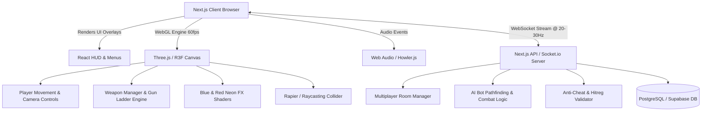

# 🎮 PROJECT LENA: GUN GAME — MASTER BUILD PLAN
**Brand:** LENA  
**Theme & Aesthetic:** High-Octane Cyber-Arena / Neon Cyan-Blue (`#00E5FF`, `#2563EB`) & Crimson Electric Red (`#FF0055`, `#DC2626`)  
**Technology Stack:** Next.js (App Router), React, Three.js / React Three Fiber (R3F) & WebGL, Tailwind CSS, Zustand, WebSocket / Socket.io  
**Document Version:** 1.0.0  
**Status:** Approved for Build  

---

## 📑 TABLE OF CONTENTS
1. [Executive Summary & Brand Identity](#1-executive-summary--brand-identity)
2. [PRD — Product Requirements Document](#2-prd--product-requirements-document)
3. [DRD — Design Requirements Document](#3-drd--design-requirements-document)
4. [TRD — Technical Requirements Document](#4-trd--technical-requirements-document)
5. [ADR — Architecture Decision Records](#5-adr--architecture-decision-records)
6. [Implementation Roadmap & Milestones](#6-implementation-roadmap--milestones)

---

# 1. EXECUTIVE SUMMARY & BRAND IDENTITY

### 1.1 Brand Vision: LENA
**LENA** represents precision, fierce competitiveness, and cutting-edge digital styling. The game is an adrenaline-fueled, fast-paced, first-person browser-based **Gun Game** where players cycle through a tier of lethal firearms with every confirmed elimination. The match culminates in a high-stakes final tier melee victory.

### 1.2 Signature Color System: DUAL NEXUS (Blue vs Red)
The visual identity of LENA is anchored on the clash and harmony of **Electric Blue** (order, precision, shield, velocity) and **Crimson Red** (lethality, danger, fire-rate, adrenaline).

| Element | Hex Code | Purpose / Application |
|---|---|---|
| **LENA Pure Blue** | `#00E5FF` / `#2563EB` | Team Blue, Shields, Reticle Focus, Friendly HUD, Primary Energy, Accents |
| **LENA Pure Red** | `#FF0055` / `#DC2626` | Team Red, Enemy Outlines, Muzzle Flashes, Damage Vignette, Critical HP, Kill Feed |
| **LENA Void Black** | `#08080C` | Primary Background, Deep Space Arena Surrounds |
| **LENA Carbon Dark** | `#12131A` | Menu Cards, HUD Panels, Weapon Shaders |
| **LENA Platinum White**| `#F8FAFC` | Primary Typography, Active Crosshair, High-score Flares |

---

# 2. PRD — PRODUCT REQUIREMENTS DOCUMENT

## 2.1 Product Goals
- Deliver an instant-play, zero-install WebGL Gun Game running smoothly at 60+ FPS directly in the browser via Next.js.
- Create an addictive "Weapon Ladder" progression system where each kill instantly evolves the player's weapon.
- Provide both **Solo Practice Mode** (with smart AI bots) and **Multiplayer Arena Lobbies** (real-time peer/server room battles).
- Highlight the **LENA** brand identity through a Blue & Red cyberpunk UI, customized weapon skins, and sound design.

## 2.2 User Personas
1. **The Casual Quick-Fragger (Alex, 22):** Wants to hop into a match during a work break with 0 friction, no launcher download, and responsive WASD + Mouse shooting mechanics.
2. **The Competitive Arena Veteran (Maya, 26):** Cares about tick rate, low latency, snappy weapon switches, fluid slide/jump mechanics, and climbing the LENA Global Leaderboard.
3. **The Aesthetic Streamer (Leo, 24):** Loves high-contrast visuals, screen shakes, neon particle impacts in dynamic Blue vs Red tones, and clean overlay-ready HUD elements.

## 2.3 Game Mode: Gun Game Progression (The Weapon Ladder)
Players spawn with Tier 1. Each elimination instantly promotes the player to the next Tier. If eliminated by a melee attack or falling off the map, the player is demoted by 1 Tier. The first player to score a kill with the final weapon wins the match.

### Weapon Ladder Specification (10 Tiers)
| Tier | Weapon Name | Type | Damage / Shot | Mag Size | Fire Rate | Progression Rule |
|:---:|---|---|:---:|:---:|:---:|---|
| **1** | *LENA Pulse-9* | Pistol | 34 | 12 | Semi (450 RPM) | 1 Kill to advance |
| **2** | *LENA Dual Strikers* | Dual Pistols | 24 x 2 | 24 | High (600 RPM) | 1 Kill to advance |
| **3** | *LENA Viper-SMG* | Submachine Gun | 22 | 30 | Auto (850 RPM) | 1 Kill to advance |
| **4** | *LENA Cyber-Shotgun* | Pump Shotgun | 12x8 (96) | 6 | Pump (75 RPM) | 1 Kill to advance |
| **5** | *LENA AR-Cobalt* (Blue Burst) | Assault Rifle | 32 | 30 | 3-Round Burst | 1 Kill to advance |
| **6** | *LENA Crimson Fury* (Red Auto)| Heavy Rifle | 42 | 25 | Auto (550 RPM) | 1 Kill to advance |
| **7** | *LENA Rail-Sniper* | Bolt Sniper | 120 (OHK Head)| 5 | Bolt (40 RPM) | 1 Kill to advance |
| **8** | *LENA Plasma Blaster* | Projectile AOE | 75 | 4 | Semi (120 RPM) | 1 Kill to advance |
| **9** | *LENA Micro-Launcher* | Rocket AOE | 100 | 2 | Slow (60 RPM) | 1 Kill to advance |
| **10**| *LENA Neon Katana / Blade* | Melee | 100 | ∞ | Swing (90 RPM) | **FINAL KILL FOR VICTORY** |

## 2.4 Core Functional Requirements
- **FR-01: Movement & Physics:** WASD movement, Sprint (Shift), Jump (Space), Crouch/Slide (C/Ctrl), and Mouse aim with configurable sensitivity.
- **FR-02: Instant Gun Ladder Mechanics:** Instantaneous weapon switch animation upon kill confirmation with audio cue and Blue/Red level-up FX.
- **FR-03: Demotion Mechanic:** Getting knife-killed or suicide demotes player 1 weapon tier.
- **FR-04: Matchmaking & Custom Rooms:** 
  - Quick Play (join active public room or bot match).
  - Create Custom Room (set Max Players 2–10, Map Selection, Bot Fill ON/OFF, Kill Goal).
- **FR-05: Real-Time HUD:**
  - Dynamic Blue shield bar & Red health bar.
  - Weapon tier progression bar (e.g. `TIER 7 / 10 - RAIL-SNIPER`).
  - Real-time Kill Feed with LENA custom badges.
  - Minimap with blue allies / red enemies.
- **FR-06: Leaderboard & Stats:**
  - In-match TAB scoreboard (Kills, Deaths, Current Tier, Ping).
  - Global LENA Hall of Fame (Wins, K/D Ratio, Accuracy, Headshot %).
- **FR-07: Audio & Sound Effects:**
  - Dynamic synth-wave / cyberpunk OST with volume controls.
  - Spatial 3D sound for footsteps, gunfire, reload, and announcer voice ("LENA LEADING", "TIER UP", "DEMOTED", "VICTORY").

---

# 3. DRD — DESIGN REQUIREMENTS DOCUMENT

## 3.1 Visual Language & Theme
The LENA aesthetic is **Cyber-Industrial Neon**. It combines dark matte carbon surfaces, brushed titanium, and high-frequency glowing neon circuits in sharp **Electric Blue** and **Crimson Red**.

### 3.2 Design Tokens & Theme Configuration

```css
/* LENA Design Tokens (Root CSS) */
:root {
  /* Brand Accents */
  --lena-blue-primary: #00E5FF;
  --lena-blue-secondary: #0284C7;
  --lena-blue-glow: rgba(0, 229, 255, 0.45);
  
  --lena-red-primary: #FF0055;
  --lena-red-secondary: #E11D48;
  --lena-red-glow: rgba(255, 0, 85, 0.45);
  
  /* Surfaces & Backgrounds */
  --lena-bg-void: #060709;
  --lena-bg-surface: #0E1017;
  --lena-bg-card: rgba(18, 20, 29, 0.85);
  --lena-border-glass: rgba(255, 255, 255, 0.08);

  /* Typography */
  --font-display: 'Rajdhani', 'Orbitron', sans-serif;
  --font-body: 'Inter', system-ui, sans-serif;
}
```

## 3.3 Screen Layouts & Wireframes

### Screen 1: Main Menu & LENA Lobby Hub
```
+---------------------------------------------------------------------------+
| [ L E N A ]  // CYBER GUN GAME              [USER: LENA_CHAMPION] [⚙ SETTINGS]|
+---------------------------------------------------------------------------+
|                                                                           |
|   +-------------------+    +------------------------------------------+   |
|   |   PLAY ARENA      |    |            3D WEAPON SHOWCASE            |   |
|   |   > QUICK MATCH   |    |                                          |   |
|   |   > BOT PRACTICE  |    |         [ 3D Model: LENA AR-Cobalt ]     |   |
|   |   > CUSTOM LOBBY  |    |         Glowing Blue & Red Accents       |   |
|   +-------------------+    |                                          |   |
|   |   ARMORY & SKINS  |    |   Tier: 05 // Type: Assault Rifle        |   |
|   |   LEADERBOARDS    |    +------------------------------------------+   |
|   |   CONTROLS/AUDIO  |    | CURRENT STREAK: 12 WINS | TOP 1% GLOBAL  |   |
|   +-------------------+    +------------------------------------------+   |
|                                                                           |
| [LENA ESPORTS 2026]              [ROOM: #NA-9021]  [SERVERS: 24ms ONLINE] |
+---------------------------------------------------------------------------+
```

### Screen 2: In-Game Combat HUD
```
+---------------------------------------------------------------------------+
| [RED] ENEMY_99 (Tier 6) [KILLFEED] LENA_1 (Tier 5) ──🔫──> NOOB_4         |
|                                                                           |
|      [ MINI-MAP ]                                                         |
|      (●) Red Enemy                                                        |
|      (▲) Player (Blue)                                                    |
|                                                                           |
|                                     +                                     |
|                                ( Crosshair )                              |
|                                                                           |
|                                                                           |
| +-------------------------+                  +--------------------------+ |
| | HP: [██████████] 100    |                  | WEAPON: LENA AR-COBALT   | |
| | SH: [████████░░]  80    |                  | AMMO:   30 / ∞           | |
| | TIER PROGRESS: [5 / 10] |                  | [BLUE/RED POWER READY]   | |
| +-------------------------+                  +--------------------------+ |
+---------------------------------------------------------------------------+
```

---

# 4. TRD — TECHNICAL REQUIREMENTS DOCUMENT

## 4.1 Technology Stack Matrix
| Layer | Technology | Rationale |
|---|---|---|
| **Framework** | **Next.js 15 (App Router)** | Instant page loading, dynamic routing for rooms, SEO landing page, server actions |
| **Frontend UI** | **React 19, Tailwind CSS, Lucide Icons, Framer Motion** | Ultra-responsive UI overlays, animated HUD elements, modular menu architecture |
| **3D Render Engine**| **Three.js / React Three Fiber (R3F) + Drei** | WebGL 60+ FPS hardware acceleration, custom shaders, realistic lighting & particles |
| **Physics & Collision**| **Rapier.js / Custom Raycast Bounding Hierarchy (BVH)** | Fast deterministic spatial partitioning for hitscan and projectile collisions |
| **State Store** | **Zustand** | Zero-boilerplate high-frequency state updates (ammo, health, position, weapon tier) |
| **Audio Engine** | **Howler.js / Web Audio API** | Low latency, 3D spatial audio panning, background OST crossfading |
| **Multiplayer Sync**| **Socket.io / WebSockets (Node/Edge Worker)** | Low latency room state sync, tick synchronization, binary delta updates |
| **Database & Auth** | **Prisma + PostgreSQL / Supabase** | Player profiles, ELO ranking, global high-scores, custom settings |

## 4.2 Application Architecture Diagram



## 4.3 Directory & Codebase Structure
```text
lena-gun-game/
├── public/
│   ├── assets/
│   │   ├── audio/           # Sound effects (shoots, reload, announcer, OST)
│   │   ├── models/          # 3D .glb models (weapons, arena, player skins)
│   │   └── textures/        # PBR materials, crosshairs, UI badges
├── src/
│   ├── app/
│   │   ├── layout.tsx       # Root layout with LENA global styles & fonts
│   │   ├── page.tsx         # Main Menu, Armory Showcase, Play Launcher
│   │   ├── play/
│   │   │   └── page.tsx     # Fullscreen Arena Game Viewport
│   │   ├── leaderboard/
│   │   │   └── page.tsx     # Global LENA rankings
│   │   └── api/
│   │       ├── match/       # Matchmaking REST endpoints
│   │       └── score/       # Score submission & stats
│   ├── components/
│   │   ├── canvas/          # 3D Scene Components
│   │   │   ├── ArenaScene.tsx
│   │   │   ├── Player.tsx
│   │   │   ├── Bot.tsx
│   │   │   ├── WeaponModel.tsx
│   │   │   ├── BulletTracer.tsx
│   │   │   └── ParticleEmitter.tsx (Blue/Red Sparks)
│   │   ├── hud/             # 2D Screen Overlays
│   │   │   ├── Crosshair.tsx
│   │   │   ├── HealthBar.tsx
│   │   │   ├── WeaponProgress.tsx
│   │   │   ├── KillFeed.tsx
│   │   │   ├── MiniMap.tsx
│   │   │   └── ScoreboardModal.tsx
│   │   └── ui/              # Menu & Button components (LENA Cyber Styled)
│   ├── hooks/
│   │   ├── useGameLoop.ts
│   │   ├── useKeyboardControls.ts
│   │   ├── usePointerLock.ts
│   │   └── useAudio.ts
│   ├── lib/
│   │   ├── constants/       # Weapons tier config, color tokens
│   │   ├── game/
│   │   │   ├── WeaponEngine.ts
│   │   │   ├── BotAI.ts
│   │   │   └── CollisionSystem.ts
│   │   └── socket/          # Client socket manager
│   └── store/
│       ├── useGameStore.ts  # Active match state (Health, Tier, Score, Kills)
│       └── useUserStore.ts  # User config, audio settings, sens
├── server/                  # Dedicated WebSocket Room Server (Node.js/Socket.io)
│   ├── index.ts
│   ├── Room.ts
│   └── BotController.ts
├── tailwind.config.ts
├── tsconfig.json
└── package.json
```

## 4.4 Data Schemas & Contracts

### 1. Weapon Definition Schema (`Weapon.ts`)
```typescript
export interface LENAWeapon {
  id: string;
  tier: number;
  name: string;
  type: 'pistol' | 'dual' | 'smg' | 'shotgun' | 'rifle' | 'sniper' | 'heavy' | 'launcher' | 'melee';
  damage: number;
  fireRate: number; // in milliseconds between shots
  magazineSize: number;
  reloadTime: number; // in seconds
  spread: number;
  recoil: { pitch: number; yaw: number };
  bulletSpeed: number; // 0 for hitscan
  isHitscan: boolean;
  colorTheme: 'blue' | 'red' | 'dual';
  modelPath: string;
  soundFire: string;
  soundReload: string;
}
```

### 2. Player State Schema (Zustand & Socket Payload)
```typescript
export interface PlayerState {
  id: string;
  name: string;
  team: 'blue' | 'red';
  position: [number, number, number];
  rotation: [number, number, number];
  health: number;
  maxHealth: number;
  shield: number;
  currentTier: number;
  currentWeapon: LENAWeapon;
  ammoInMag: number;
  isReloading: boolean;
  kills: number;
  deaths: number;
  score: number;
  ping: number;
}
```

---

# 5. ADR — ARCHITECTURE DECISION RECORDS

### ADR-001: Next.js App Router for Web Shell & Game Wrapper
- **Status:** Accepted
- **Context:** We need a modern web framework that handles fast landing pages, SEO, authentication, leaderboards, and a high-performance WebGL Canvas overlay without unnecessary DOM rerenders.
- **Decision:** Use Next.js 15 App Router with client components (`"use client"`) isolating the 3D Canvas and high-frequency HUD layers, while server components handle stats, leaderboards, and initial room metadata.
- **Consequences:** Superb page loading speeds, full React ecosystem support, clean separation between UI overlay state and 3D rendering pipeline.

### ADR-002: Rendering Engine — Three.js / React Three Fiber (R3F)
- **Status:** Accepted
- **Context:** The game requires 60+ FPS rendering, first-person camera movement, procedural muzzle flashes, custom Blue & Red neon shaders, and 3D weapon meshes.
- **Decision:** Use React Three Fiber (`@react-three/fiber`) and `@react-three/drei` on top of Three.js.
- **Consequences:** Declarative React structure for 3D scenes, easy hook integration (`useFrame`), high reusability of shaders and lighting effects.

### ADR-003: Physics & Hit Detection Strategy
- **Status:** Accepted
- **Context:** Fast-paced shooters require crisp, instantaneous hit feedback without physics glitches.
- **Decision:** Hybrid model:
  - **Hitscan Weapons (Pistols, Rifles, Snipers):** Raycasting with Three.js `Raycaster` against BVH-accelerated player hitboxes (Head: 2.0x, Body: 1.0x, Limbs: 0.75x).
  - **Projectiles (Plasma, Rockets):** Stepped ballistic physics with sphere-sweep collision detection.
  - **Environment Collision:** Simplified box/mesh colliders via Rapier.js.
- **Consequences:** Near-zero hit registration delay, high accuracy, lightweight CPU load.

### ADR-004: Client-Side State Management with Zustand
- **Status:** Accepted
- **Context:** React's native `useState` causes full component subtree re-renders, which drops framerates if triggered on every frame or bullet fire.
- **Decision:** Use **Zustand** stores with transient subscriptions. High-frequency updates (crosshair spread, ammo counter, health) only re-render their isolated leaf components.
- **Consequences:** Steady 60–120 FPS rendering, zero frame drops during intense combat.

### ADR-005: Theme Engine — Dual Blue/Red Shaders & Tailwind CSS
- **Status:** Accepted
- **Context:** LENA brand requires an unmistakable, consistent color identity across 2D UI and 3D space.
- **Decision:** 
  - 2D DOM: Tailwind CSS configured with custom LENA color palette (`lena-blue-*`, `lena-red-*`) with backdrop blur filters and glowing drop shadows.
  - 3D Space: Custom GLSL fragment shaders for weapon energy lines, bullet tracers, shield bubbles, and particle sparks.
- **Consequences:** Cohesive futuristic presentation that feels like a polished commercial title.

---

# 6. IMPLEMENTATION ROADMAP & MILESTONES

### Phase Breakdown
1. **Milestone 1 (Foundations):** Next.js 15 app skeleton, Tailwind styling tokens, Three.js canvas viewport, WASD + PointerLock mouse controls.
2. **Milestone 2 (Arsenal & Combat):** 10-tier weapon progression ladder, sound triggers, bullet raycasting, hitboxes, recoil, and particle effects.
3. **Milestone 3 (Game Rules & AI):** Offline Bot match mode, LENA Cyber HUD (Health, Shields, Ammo, Weapon Tier, Kill Feed), win conditions.
4. **Milestone 4 (Multiplayer & Polish):** WebSocket multiplayer lobby, TAB scoreboard, global leaderboard, audio settings, performance profiling for 60+ FPS on all devices.

---
*Generated for **LENA** — Blue & Red Cyber Gun Game Build Plan.*
